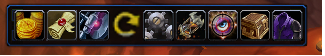
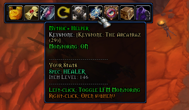
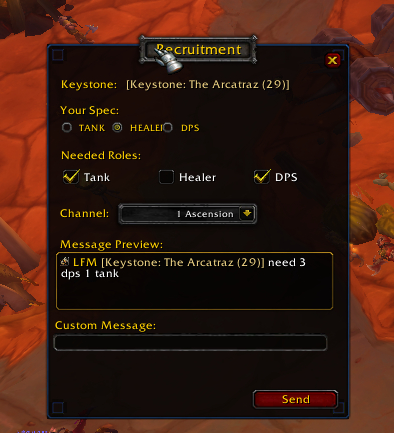
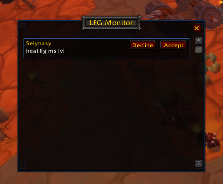
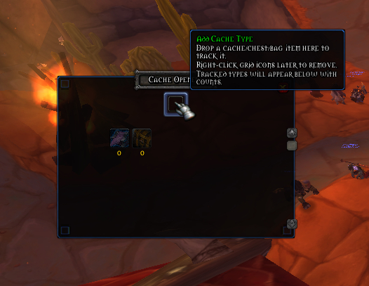
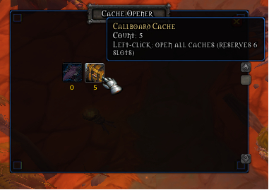

## Example images 
 
 
 
 
 
 
 

# HerosArmyKnife

A lightweight, modular toolbar addon for Ascension WoW (Wrath 3.3.5). Quickly access quality‑of‑life tools and gameplay helpers from a compact, draggable toolbar with clean theming and readable tooltips.

- Interface: 30300 (Wrath 3.3.5)
- Game: Ascension client
- SavedVariables: `HerosArmyKnifeDB`

## Highlights
- Movable toolbar with per‑module icons and colorized tooltips
- Theme system plus scoped Morpheus font for addon UI only
- Adjustable global font size for the addon UI
- Scrollable Options UI with improved two‑column layout
- Optional Debug module for safe, non‑destructive testing

## Install
1. Download or clone this repository.
2. Copy the `HerosArmyKnife` folder into your addons directory, for example:
	 - Ascension launcher path: `Interface/AddOns/HerosArmyKnife`
3. Relaunch the game (or type `/reload`).
4. Enable the addon on the character select AddOns screen.

## Quick Start
- Drag the toolbar by its frame to reposition it.
- Right‑click the toolbar frame to access quick options.
- Open the main options: `/hak options`.
- Toggle modules from the Modules sub‑panel.

### Slash Commands
- `/hak options` or `/hak config`: Open the Options panel (invoked twice internally to ensure the category opens).
- `/hak layout`: Rebuild the toolbar layout (apply spacing/scale/padding).
- `/hak show`: Build and/or show the toolbar.
- `/hak reload`: Reload the UI.

## Configuration
Open the Options panel from Interface → AddOns → HerosArmyKnife or via `/hak options`.

- Orientation: Growth direction of the toolbar (horizontal/vertical).
- Theme: Apply a theme to HAK frames and tooltips.
- Icon Scale & Spacing: Size and gap between toolbar buttons.
- Toolbar Padding: Fine‑tune the frame padding (top/bottom/left/right).
- Font Size: Global Morpheus font size for addon UI elements.
- Notifications: Where transient notifications appear (Chat or Center).
- Lock Toolbar: Prevent dragging once positioned.

The options view is scrollable. If you add many modules, scroll to reach all settings.

## Modules
Each toolbar icon maps to a self‑contained module with its own tooltip, click behavior, and (optionally) a settings page.

- About: Overview window with credits and a Discord invite link (copy button in‑panel).
- Settings: Central access to global options (plus Modules sub‑panel).
- Reload: Quick reload shortcut.
- Transmog: Placeholder entry.
- SellTrash: Sells grey‑quality items and user‑tracked vendor items at vendors; optional debug toggle.
- CacheOpener: Detects likely cache/box items; opens sequentially with a delay; small grid UI with scroll.
- MythicPlusHelper:
	- Keystone scanning with icon display
	- Monitoring indicator on toolbar icon
	- LFM Queue watcher (channel filter, pattern matching)
	- Recruitment helper (interval broadcasts, role needs, custom text)
	- Party Info sharing via addon messages (spec + ilvl)
- RareTracker: Detects rare/rare‑elite on target/mouseover; optional auto‑mark, popup & sound; repeat‑delay throttle.
- DebugTools (optional): Safe test harness for module features (sample queue messages, rare popup, etc.). Safe to delete before release.

For per‑module usage notes and settings, see `docs/Modules.md`.

## Compatibility
- Built for Ascension client based on Wrath 3.3.5 (`## Interface: 30300`).
- Fonts/themes are applied only to HAK’s frames and tooltips; the rest of the UI remains untouched.

## Troubleshooting
- Options don’t scroll or some controls appear out of frame:
	- Re‑open via `/hak options` (Blizzard panel quirk); scrolling is enabled.
	- Use `/reload` after first install/update.
- Missing textures or icon tints:
	- Themes fall back gracefully. If an icon is missing on your client, a question mark icon is used.
- SellTrash didn’t trigger at vendor:
	- Ensure the module is enabled in Modules and "Auto" is on in its module options.
- LFM window empty:
	- Enable monitoring in the MythicPlusHelper context menu or options.

## Development
HerosArmyKnife is intentionally modular. Typical module components:

- Register toolbar icon: `addon:RegisterToolbarIcon(key, texture, onClick, onTooltip)`
- Optional options page: `addon:RegisterModuleOptions(key, function(panel) ... end)`
- Optional init defaults: `addon:RegisterInit(function() addon:GetModuleSettings(key, defaults) end)`
- Themed frames: `addon:CreateThemedFrame(parent, name, w, h, variant)` with `variant` `panel`/`subpanel`.
- Tooltip colorization: Provide lines; the toolbar enhances action verbs and ON/OFF tokens automatically.

Repository structure (selected):
- `Core.lua` – bootstrap and shared helpers
- `Theme.lua` – theme registry and application; scoped font utilities
- `Toolbar.lua` – toolbar creation, tooltip formatting, indicators
- `Options.lua` – main options panel (scrollable) and Modules sub‑panel
- `Modules/*` – feature modules (About, SellTrash, CacheOpener, MythicPlusHelper, RareTracker, DebugTools)

For local testing, the DebugTools module can inject safe samples and open test UIs.

## Support
- Open an issue on GitHub with steps to reproduce.
- For community chat, use the Discord invite link shown in the About window.

## Contributing and Changelog
- Contributing guide: see `CONTRIBUTING.md` for branching, coding style, and PR checklist.
- Changelog: see `CHANGELOG.md` for release notes and recent changes.
